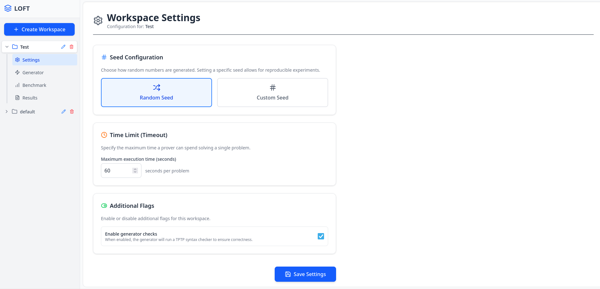
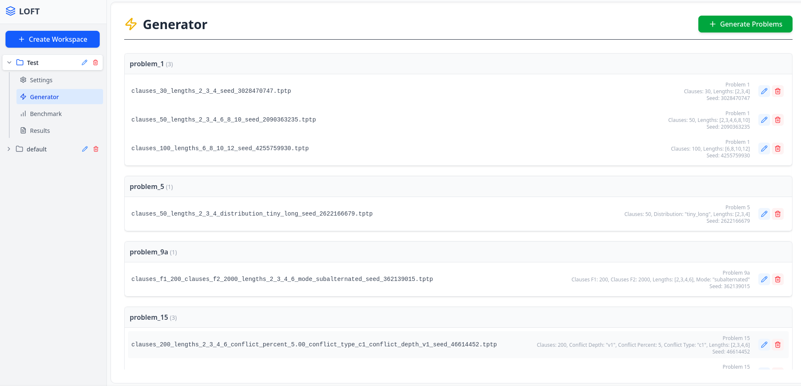
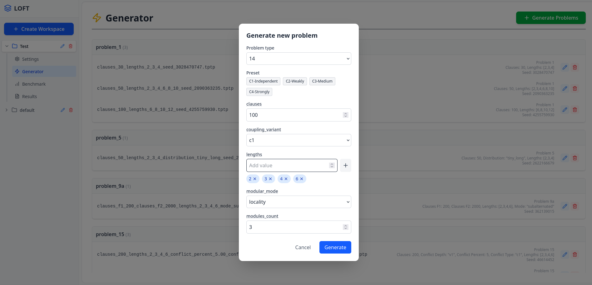
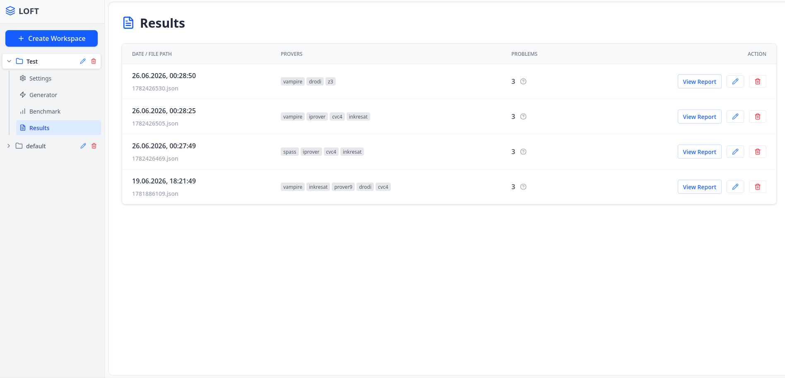
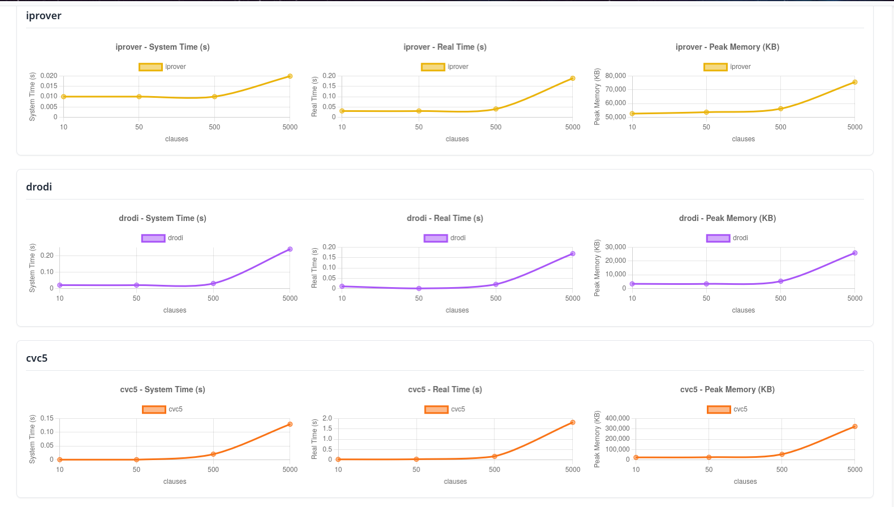

# LOFT

### Autorzy: Emil Wajda, Kacper Wojciuch

---

## Uruchamianie

### Aplikacja webowa - wersja produkcyjna

Jeśli interesuje Cię szybkie uruchomienie aplikacji bez konieczności instalowania dodatkowego oprogramowania,
skorzystaj z tego sposobu.

1. Zainstaluj [Dockera](https://www.docker.com/get-started).
2. Sklonuj to repozytorium i przejdź do jego katalogu głównego.
3. Zbuduj obrazy:
   ```bash
   $ docker compose build base
   $ docker compose --profile tools build
   ```
4. Uruchom aplikację webową:
   ```bash
   $ docker compose up
   ```
5. Otwórz przeglądarkę i przejdź do `http://localhost:8000`.

### Aplikacja webowa - wersja deweloperska

Jeśli chcesz rozwijać aplikację lub wprowadzać w niej zmiany, skorzystaj z tego sposobu.

**Podpowiedź:** użytkownicy [NixOS](https://nixos.org/) mogą wykorzystać plik `shell.nix`, aby łatwo skonfigurować środowisko.

1. Zainstaluj [Pythona](https://www.python.org/downloads/) w wersji **3.13+**.
2. Zainstaluj [NPM](https://nodejs.org/en/download/).
3. Sklonuj to repozytorium i przejdź do jego katalogu głównego.
4. Utwórz i aktywuj wirtualne środowisko Pythona w podfolderze `core`:
   ```bash
   $ python -m venv .venv
   $ source .venv/bin/activate  # Linux/MacOS
   $ .venv\Scripts\activate     # Windows
   ```
5. Zainstaluj zależności Pythona (dalej w katalogu `core`):
   ```bash
   $ pip install .
   ```
6. Przejdź do podfolderu `frontend` i zainstaluj zależności frontendu:
   ```bash
   $ npm install
   ```
7. Uruchom backend oraz frontend:
   ```bash
   $ python -m loft  # W terminalu 1 (katalog core)
   $ npm run dev     # W terminalu 2 (katalog frontend)
   ```
8. Otwórz przeglądarkę i przejdź do `http://localhost:5173`.

Jeśli chcesz również testować benchmarki, będziesz potrzebować Dockera tak czy inaczej.
Możesz wtedy wybiórczo budować tylko potrzebne obrazy Dockera. Na przykład, aby zbudować obraz z proverem Vampire, użyj:

```bash
$ docker compose build vampire
```

### Interfejs wiersza poleceń (CLI)

Jeśli wolisz korzystać z niektórych funkcjonalności aplikacji w trybie konsolowym (np. do szybkich testów), skorzystaj z tego sposobu.

Moduł backendowy posiada wbudowaną pomoc odnośnie dostępnych poleceń. W zależności od dostępnego środowiska,
użyj jednej z poniższych komend:

```bash
$ python -m loft --help                # Środowisko deweloperskie
$ docker compose run --rm core --help  # Środowisko produkcyjne
```

## Przewodnik użytkownika

Niniejsza sekcja przedstawia podstawy korzystania z aplikacji webowej LOFT. Interfejs składa się z paska
bocznego po lewej stronie oraz głównego obszaru roboczego po prawej.

### Tworzenie i wybór workspace

Po uruchomieniu aplikacji należy najpierw utworzyć lub wybrać przestrzeń roboczą (workspace). W pasku bocznym
znajduje się przycisk "Create Workspace" służący do utworzenia nowego workspace.
Po utworzeniu pojawi się na liście i można go rozwinąć, aby zobaczyć dostępne zakładki:
**Settings**, **Generator**, **Benchmark** oraz **Results**.

### Konfiguracja ustawień (Settings)



Zakładka **Settings** umożliwia konfigurację dwóch kluczowych parametrów:

- **Seed Configuration** - wybór między losowym seedem (każde generowanie da inne wyniki)
  a stałym seedem (powtarzalne eksperymenty),
- **Prover Timeout** - maksymalny czas w sekundach, jaki prover ma na rozwiązanie problemu.
  Po przekroczeniu tego czasu wynik zostanie oznaczony jako `TIMEOUT`.

Po wprowadzeniu zmian należy kliknąć przycisk **Save Settings**.

### Generowanie problemów (Generator)



Zakładka **Generator** wyświetla listę wszystkich wygenerowanych problemów w danym workspace,
pogrupowanych według typu problemu. Każdy problem pokazuje swoje parametry oraz seed użyty do generowania.
Problemy można usuwać klikając ikonę kosza.

Aby wygenerować nowy problem, należy kliknąć przycisk **Generate Problems** w prawym górnym rogu.



Otworzy się modal z formularzem, w którym można:

1. **Wybrać typ problemu** - z listy rozwijanej (Problem 1-8),
2. **Wybrać preset** - predefiniowany zestaw parametrów (np. Default, Short, Long),
3. **Dostosować parametry** - każdy typ problemu ma swoje specyficzne parametry,
   takie jak liczba klauzul, długości klauzul, rozkład itp.

Po skonfigurowaniu parametrów kliknięcie **Generate** utworzy nowy plik TPTP w workspace.

### Uruchamianie benchmarków (Benchmark)


Zakładka **Benchmark** służy do konfiguracji i uruchamiania testów wydajnościowych. Interfejs składa się z dwóch sekcji:

**Wybór problemów:**

- Problemy są pogrupowane według typu (problem_1, problem_2 itd.),
- Można rozwinąć grupę klikając na jej nazwę,
- Zaznaczanie/odznaczanie problemów odbywa się przez kliknięcie na dany problem,
- Przycisk "Select/Deselect All" zaznacza lub odznacza wszystkie problemy w grupie.

**Wybór proverów:**

- Na dole ekranu znajduje się lista checkboxów z dostępnymi proverami (Vampire, SPASS, E, iProver, Prover9, Z3, CVC4, CVC5, Drodi),
- Należy zaznaczyć co najmniej jeden prover.

Po wybraniu problemów i proverów kliknięcie **Run Benchmark** uruchomi testy.
Aplikacja automatycznie przejdzie do zakładki Results i będzie wyświetlać wyniki w czasie rzeczywistym.

### Przeglądanie wyników (Results)



Zakładka **Results** wyświetla listę wszystkich przeprowadzonych benchmarków z informacjami:

- Data/ID benchmarku,
- Lista użytych proverów,
- Liczba testowanych problemów.

Kliknięcie **View Report** otwiera szczegółowy widok wybranego benchmarku.


Widok szczegółowy prezentuje tabelę z wynikami dla każdej kombinacji problem × prover:

- **Result** - wynik provera (`SATISFIABLE`, `UNSATISFIABLE`, `UNKNOWN`, `TIMEOUT`),
- **Real Time** - rzeczywisty czas wykonania w sekundach,
- **System Time** - czas procesora w sekundach,
- **Memory** - szczytowe zużycie pamięci w KB.

Wyniki są kolorowane dla łatwiejszej interpretacji:

- Zielony = `SATISFIABLE`,
- Czerwony = `UNSATISFIABLE`,
- Żółty = `UNKNOWN`,
- Szary = `TIMEOUT` lub w trakcie.

### Wykresy porównawcze



Pod tabelą wyników znajdują się interaktywne wykresy umożliwiające analizę porównawczą:

- **Wybór parametru (oś X)** - można wybrać parametr problemu (np. liczba klauzul),
  względem którego będą prezentowane wyniki,
- **Metryki (oś Y)** - czas systemowy, czas rzeczywisty lub zużycie pamięci,
- **Osobne trzy wykresy dla każdego provera** - pozwala łatwo porównać wydajność różnych proverów
  w zależności od parametrów problemu.

Wykresy są szczególnie przydatne do analizy skalowalności proverów - jak zmienia się czas
rozwiązywania w zależności od rozmiaru problemu.

## Struktura projektu

Najważniejszymi ścieżkami w projekcie są:

- `core/` - moduł backendowy napisany w Pythonie, zawierający logikę generowania formuł, zarządzania benchmarkami poprzez
  uruchamianie kontenerów Dockera na żądanie oraz API dla frontendu,
- `frontend/` - moduł frontendowy napisany w [TypeScript](https://www.typescriptlang.org/) z wykorzystaniem frameworka
  [Vite](https://vite.dev/) + [React](https://react.dev/), zawierający interfejs użytkownika aplikacji webowej,
- `provers/` - katalog zawierający pliki Dockerfile dla poszczególnych proverów,
- `tools/` - dodatkowe narzędzia (sprawdzanie składni TPTP oraz konwertery formatów), również oparte na Dockerze,
- `workspaces/` - przestrzenie robocze, które wykorzystuje projekt do przechowywania swoich rezultatów
  (np. wygenerowane formuły, wyniki benchmarków).
- `docker-compose.yml` - plik konfiguracyjny [Docker Compose](https://docs.docker.com/compose/), definiujący usługi
  i obrazy potrzebne do uruchomienia aplikacji oraz proverów.

## Struktura `workspaces`

Katalog `workspaces/` zawiera podkatalogi, które są tworzone w momencie, gdy użytkownik sobie tego zażyczy.
Każdy katalog reprezentuje jedną przestrzeń roboczą, w której mogą być przechowywane formuły, ustawienia oraz
wyniki benchmarków. Struktura katalogu przestrzeni roboczej jest następująca:

- `settings.json` - plik konfiguracyjny przestrzeni roboczej, zawierający informacje o seedzie generatora
  formuł oraz czasie przerwania działania proverów (timeout) - opcjonalny,
- `problem_1/`, `problem_2/`, ... - podkatalogi reprezentujące poszczególne typy problemów logicznych,
  zawierające jedynie pliki w formacie TPTP - nazwy plików są bez znaczenia, ważne jest jedynie rozszerzenie
  oraz ich zawartość z poprawnym komentarzem zawierającym informacje o parametrach generatora,
- `convertion_cache/` - katalog przechowujący pliki w formatach innych niż TPTP, wygenerowane
  przez konwertery - aby uniknąć wielokrotnego konwertowania tych samych plików, pliki te polegają na hashach
  (skrótach) oryginalnych plików TPTP,
- `results/` - katalog przechowujący wyniki uruchomień proverów na formułach z danej przestrzeni roboczej.

## Budowanie obrazów Dockera

Projekt polega na jednym bazowym obrazie Dockera (`base`), który zawiera wspólne zależności dla wszystkich proverów.
Z kolei sam obraz bazowy dziedziczy po obrazie [`nixos/nix`](https://hub.docker.com/r/nixos/nix).
Wybór tego obrazu został podyktowany klikoma powodami:

- Nix stawia na powtarzalność budowania oprogramowania, co daje nam jeszcze silniejszą gwarancję, że projekt będzie
  można zbudować nawet po wielu latach, nie martwiąc się o zmieniające się zależności systemowe - w celu aktualizacji
  oprogramowania wewnątrz wszystkich kontenerów, należy jedynie zmienić commit kanału `nixpkgs`,
  ustawiony na stałe właśnie w obrazie `base`,
- pliki konfiguracyjne `.nix` są pisane w deklaratywnym, funkcyjnym języku, co ułatwia wyrażenie logiki związanej
  z budowaniem pakietów i jest mniej podatne na błędy niż tradycyjne skrypty pisane w Bashu,
- wiele spośród wykorzystywanych przez nas narzędzi (np. proverów) jest już dostępnych w `nixpkgs`, co upraszcza
  proces ich instalacji i zarządzania wersjami.

Jak już wspomniano, każdy obraz w projekcie dziedziczy po obrazie `base` i instaluje jedynie specyficzne dla siebie
dependencje. Jeśli jest to konieczne, dostarczone są również skrypty procesu budowy danego pakietu (pliki `.nix`)
oraz ewentualne pliki `entrypoint.sh`, modyfikujące domyślne zachowanie kontenera przy jego uruchomieniu.

Plik `docker-compose.yml` definiuje wszystkie obrazy oraz usługi potrzebne do uruchomienia aplikacji. Mimo to,
jedynym serwisem uruchamianym na stałe przy użyciu komendy `docker compose up` jest `core` (backend aplikacji webowej).
Jest to celowe działanie, mające na celu oszczędność zasobów systemowych - provery i narzędzia są uruchamiane
dopiero na żądanie użytkownika, poprzez interfejs webowy lub CLI. Takie zachowanie zostało osiągnięte dzięki
opcji `profiles` w Docker Compose oraz udostępnieniu socketu Dockera wewnątrz kontenera `core`
(`/var/run/docker.sock` w `volumes`). Dzięki temu, nie jest konieczne stosowanie podejścia opartego na
mikroserwisach i udostępniania nadmiarowych interfejsów sieciowych między kontenerami (to podejście było
stosowane w projekcie przed jego całkowitym przepisaniem).

Warto również wspomnieć o procesie budowania obrazu `core` - w tym przypadku wykorzystano mechanizm budowania
wieloetapowego ([multi-stage build](https://docs.docker.com/build/building/multi-stage/)), aby móc połączyć
w jednym obrazie zarówno aplikację backendową (Python), jak i frontendową (Node.js). Wspiera to również
cache'owanie warstw Dockera, co przyspiesza proces budowania obrazu podczas wprowadzania zmian w kodzie źródłowym
aplikacji - był to jeden z celów, który dyktował również niektóre nadmiarowe polecenia w rozmaitych plikach `Dockerfile`.

## Backend aplikacji

Backend aplikacji LOFT został zaimplementowany w języku **Python 3.13+** z wykorzystaniem asynchronicznego
frameworka webowego [Quart](https://quart.palletsprojects.com/). Kod źródłowy znajduje się w katalogu `core/loft/`.

### Zależności

Plik `pyproject.toml` definiuje następujące główne zależności:

- **Quart** (`>=0.20.0`) - asynchroniczny framework webowy oparty na ASGI, kompatybilny z Flask,
- **aiofiles** (`>=24.1.0`) - biblioteka do asynchronicznego I/O na plikach.

### Struktura modułów

#### Moduł główny (`main.py`, `cli.py`)

- `main.py` - punkt wejścia aplikacji, definiuje parser argumentów CLI oraz uruchamia odpowiedni tryb działania
  (serwer deweloperski, generowanie problemów, uruchamianie benchmarków, sprawdzanie składni TPTP),
- `cli.py` - implementacja funkcji wywoływanych przez interfejs wiersza poleceń (`check`, `benchmark`, `generate`).

#### Moduł Docker (`docker.py`)

Zawiera funkcje do asynchronicznego uruchamiania kontenerów Docker:

- `run_docker_container()` - uruchamia kontener z podanym obrazem, przekazując dane przez stdin i odbierając stdout/stderr,
- `run_tptp_checker()` - wrapper do uruchamiania narzędzia sprawdzającego składnię TPTP.

#### Moduł formuł logicznych (`formulas.py`)

Definiuje struktury danych reprezentujące formuły logiki pierwszego rzędu (FOL) za pomocą dataclass:

- `LogicToken` - abstrakcyjna klasa bazowa z metodą `to_tptp()`,
- `Atom` - atom logiczny z nazwą i parametrem,
- `Not`, `Alternative`, `Conjunction`, `Implication` - operatory logiczne,
- `ForAll`, `Exists` - kwantyfikatory,
- `GreaterThan` - predykat porównania.

Każda klasa implementuje metodę `to_tptp()` zwracającą reprezentację w formacie TPTP.

#### Moduł budowania TPTP (`tptp_builder.py`)

Klasa `TPTPBuilder` odpowiada za:

- budowanie pojedynczych wpisów FOF w formacie TPTP,
- konwersję listy klauzul `LogicToken` na pełny string TPTP,
- dodawanie metadanych (nazwa problemu, parametry, seed) jako komentarz JSON.

#### Moduł generatorów (`generators/`)

Pakiet zawierający logikę generowania problemów logicznych:

- `generator.py` - abstrakcyjna klasa bazowa `Generator` definiująca interfejs generatorów:
  - walidacja parametrów wejściowych,
  - metody pomocnicze do generowania klauzul bezpieczeństwa i żywotnościowych,
  - sugerowanie ścieżki zapisu pliku,
- `param_spec.py` - specyfikacje typów parametrów (`Integer`, `Float`, `Boolean`, `Choice`, `IntegerList`)
  z walidacją i serializacją,
- `std_params.py` - predefiniowane, często używane parametry jako enum `StandardParams`,
- `problem1.py` - `problem8.py` - konkretne implementacje generatorów dla 8 różnych typów problemów logicznych.

Każdy generator definiuje:

- `name` - identyfikator problemu,
- `param_spec` - słownik specyfikacji parametrów,
- `presets` - predefiniowane zestawy parametrów,
- `validate_extra()` - dodatkowa walidacja międzyparametrowa,
- `generate()` - metoda zwracająca listę klauzul `LogicToken`.

#### Moduł proverów (`provers/`)

Pakiet obsługujący uruchamianie automatycznych dowodzicieli:

- `prover.py` - klasa `Prover` odpowiedzialna za:
  - uruchamianie provera na pliku problemu,
  - konwersję formatu (jeśli prover wymaga innego formatu niż TPTP),
  - cache'owanie skonwertowanych plików (w katalogu `convertion_cache/`),
- `run_output.py` - definicje wyników uruchomienia:
  - `RunResult` - enum z możliwymi wynikami (`SAT`, `UNSAT`, `UNKNOWN`, `TIMEOUT`),
  - `RunStats` - statystyki wykonania (czas systemowy, czas rzeczywisty, szczytowe zużycie pamięci),
  - `basic_result_parser()` - fabryka parserów wyjścia proverów,
- `__init__.py` - rejestr wszystkich wspieranych proverów w słowniku `KNOWN_PROVERS`.

#### Moduł benchmarków (`benchmarks.py`)

Zarządza asynchronicznym uruchamianiem benchmarków:

- `BenchmarkCell` - pojedyncza komórka wyniku (problem × prover),
- `BenchmarkResult` - pełny wynik benchmarku z timestampem i listą komórek,
- `BenchmarkOrchestrator` - koordynator benchmarków wspierający:
  - równoległe uruchamianie wielu testów,
  - streaming wyników w czasie rzeczywistym przez WebSocket,
  - zapisywanie wyników do plików JSON.

#### Moduł Web API (`web_api/`)

REST API aplikacji zbudowane na frameworku Quart:

- `__init__.py` - inicjalizacja aplikacji Quart, rejestracja tras, endpoint `/api/provers`,
- `workspaces.py` - zarządzanie przestrzeniami roboczymi (CRUD),
- `settings.py` - odczyt/zapis ustawień workspace (seed, timeout),
- `problems.py` - zarządzanie problemami (lista, generowanie, usuwanie),
- `results.py` - zarządzanie benchmarkami (lista, tworzenie, WebSocket do streamingu wyników).

### Endpointy API

| Metoda | Ścieżka                         | Opis                            |
| ------ | ------------------------------- | ------------------------------- |
| GET    | `/api/provers`                  | Lista dostępnych proverów       |
| GET    | `/api/workspaces`               | Lista workspace'ów              |
| POST   | `/api/workspaces`               | Tworzenie workspace             |
| DELETE | `/api/workspaces`               | Usuwanie workspace              |
| GET    | `/api/workspaces/<ws>/settings` | Ustawienia workspace            |
| PUT    | `/api/workspaces/<ws>/settings` | Aktualizacja ustawień           |
| GET    | `/api/problems`                 | Definicje typów problemów       |
| GET    | `/api/workspaces/<ws>/problems` | Lista problemów w workspace     |
| POST   | `/api/workspaces/<ws>/problems` | Generowanie problemu            |
| DELETE | `/api/workspaces/<ws>/problems` | Usuwanie problemu               |
| GET    | `/api/workspaces/<ws>/results`  | Lista benchmarków               |
| POST   | `/api/workspaces/<ws>/results`  | Uruchomienie benchmarku         |
| WS     | `/ws/workspaces/<ws>/results`   | WebSocket do streamingu wyników |

## Frontend aplikacji

Frontend aplikacji LOFT został zaimplementowany w języku **TypeScript** z wykorzystaniem frameworka
[React](https://react.dev/) oraz narzędzia budowania [Vite](https://vite.dev/).
Kod źródłowy znajduje się w katalogu `frontend/src/`.

### Zależności

Plik `package.json` definiuje następujące główne zależności:

- **React** (`^19.2.0`) - biblioteka do budowania interfejsów użytkownika,
- **@tanstack/react-query** (`^5.90.17`) - zarządzanie stanem serwera, cache'owanie zapytań i mutacje,
- **axios** (`^1.13.2`) - klient HTTP do komunikacji z API,
- **chart.js** + **react-chartjs-2** - biblioteka do tworzenia wykresów,
- **lucide-react** (`^0.555.0`) - ikony w stylu Lucide,
- **react-use-websocket** (`^4.13.0`) - hook do obsługi WebSocket,
- **TailwindCSS** (`^3.4.18`) - framework CSS utility-first.

Zależności deweloperskie obejmują TypeScript, ESLint oraz Vite.

### Struktura komponentów

#### Komponent główny (`App.tsx`)

Główny komponent aplikacji odpowiedzialny za:

- zarządzanie stanem aktywnego workspace i zakładki,
- routing między widokami (Settings, Generator, Benchmark, Results),
- renderowanie paska bocznego i głównej zawartości.

#### Typy danych (`types.ts`)

Definicje interfejsów TypeScript odpowiadających strukturom danych z API:

- `ParamSpec`, `ProblemType`, `ProblemTypeList` - specyfikacje typów problemów,
- `Problem`, `ProblemFileList` - problemy i ich parametry,
- `ResultSummary`, `ResultCell`, `RunStats` - wyniki benchmarków,
- `WorkspaceSettings` - ustawienia workspace,
- `TabName` - nazwy zakładek w interfejsie.

#### Komponenty Sidebar (`components/Sidebar/`)

Pasek boczny aplikacji:

- `Sidebar.tsx` - główny kontener z listą workspace'ów,
- `SidebarHeader.tsx` - nagłówek z logo LOFT,
- `WorkspaceItem.tsx` - element listy z rozwijalnymi zakładkami,
- `SidebarTab.tsx` - pojedyncza zakładka (Settings, Generator, Benchmark, Results),
- `CreateWorkspace.tsx` - formularz tworzenia nowego workspace.

#### Komponenty Settings (`components/Settings/`)

- `SettingsView.tsx` - widok ustawień workspace:
  - konfiguracja seeda generatora (losowy/stały),
  - ustawienie timeoutu dla proverów.

#### Komponenty Generator (`components/Generator/`)

- `GeneratorView.tsx` - główny widok zakładki Generator z listą problemów i przyciskiem generowania,
- `ProblemList.tsx` - lista wygenerowanych problemów pogrupowana według typu,
- `CreateProblemModal.tsx` - modal do tworzenia nowego problemu:
  - wybór typu problemu,
  - konfiguracja parametrów z presetami,
  - dynamiczne formularze dla różnych typów parametrów.

#### Komponenty Benchmark (`components/Benchmark/`)

- `BenchmarkView.tsx` - widok konfiguracji benchmarku:
  - wybór problemów do testowania (z grupowaniem według typu),
  - wybór proverów,
  - uruchamianie benchmarku.

#### Komponenty Results (`components/Results/`)

- `ResultListView.tsx` - lista wszystkich benchmarków w workspace z możliwością przeglądania szczegółów,
- `ResultView.tsx` - szczegółowy widok pojedynczego benchmarku:
  - tabela wyników (problem × prover),
  - statystyki wykonania (czas, pamięć),
  - streaming wyników w czasie rzeczywistym przez WebSocket,
- `ResultCharts.tsx` - interaktywne wykresy porównawcze:
  - wizualizacja zależności metryk od parametrów problemów,
  - wybór osi X (parametr problemu).

#### Komponent Notification (`components/Notification.tsx`)

Wyświetla powiadomienia o sukcesie/błędzie operacji w górnej części ekranu.

### Custom Hooks (`hooks/`)

Własne hooki React do zarządzania stanem i komunikacji z API:

- `useActiveWorkspace.tsx` - Context API do zarządzania aktywnym workspace,
- `useNotificationContext.tsx` - Context API do wyświetlania powiadomień,
- `useWorkspaces.tsx` - hook do CRUD na workspace'ach,
- `useProblems.tsx` - hook do zarządzania problemami (lista, generowanie, usuwanie),
- `useProblemTypes.tsx` - hook pobierający definicje typów problemów z API,
- `useMutationNotify.tsx` - wrapper na `useMutation` z automatycznymi powiadomieniami.

### Narzędzia pomocnicze (`utils.tsx`)

- `PrettyPrintParams()` - komponent formatujący parametry problemu,
- `splitPath()`, `groupProblems()` - funkcje do grupowania problemów według katalogów.

## Informacje o proverach

Obrazy Dockera dla poszczególnych proverów zawierają specyficzne podejście do ich uruchamiania.
Używany jest plik `entrypoint.sh`, który:

- wczytuje plik ze standardowego wejścia i zapisuje go do pliku tymczasowego o nazwie `input`,
- przekierowuje ewentualne błędy (stderr) do standardowego wyjścia (stdout), aby nie było konfliktu w następnym kroku,
- uruchamia komendę startową provera opakowując ją w wywołanie [GNU Time](https://www.gnu.org/software/time/)
  w celu zmierzenia czasu wykonania oraz zużycia pamięci - narzędzie to zapisuje swoje wyniki do stderr.

Lista wspieranych proverów wraz z ich krótkim opisem:

- [Vampire](https://github.com/vprover/vampire):
  - wersja z `nixpkgs`,
  - przyjmuje formuły w formacie TPTP,
- [SPASS](https://en.wikipedia.org/wiki/SPASS):
  - wersja z `nixpkgs`,
  - przyjmuje formuły w formacie TPTP po sprecyzowaniu opcji `-TPTP`,
- [E Prover](https://github.com/eprover/eprover):
  - wersja z `nixpkgs`,
  - przyjmuje formuły w formacie TPTP,
- [iProver](https://gitlab.com/korovin/iprover):
  - wersja z `nixpkgs`,
  - przyjmuje formuły w formacie TPTP, ale wymaga "uproszczonej postaci",
  - używany jest konwerter zamieniający formuły FOF na CNF (`tools/cnf`),
- [Prover9](https://www.cs.unm.edu/~mccune/prover9/):
  - wersja z `nixpkgs`,
  - przyjmuje formuły w swoim własnym formacie (LADR),
  - używany jest konwerter dostarczony wraz z Prover9 (`tools/ladr`),
- [Z3](https://github.com/Z3Prover/z3):
  - wersja z `nixpkgs`,
  - przyjmuje formuły w formacie SMT-LIB2,
  - używany jest konwerter zbudowany w `tools/smt2`,
- [CVC4](https://cvc4.github.io/):
  - wersja z `nixpkgs`,
  - przyjmuje formuły w formacie TPTP (z odpowiednimi opcjami linii komend),
- [CVC5](https://github.com/cvc5/cvc5):
  - wersja z `nixpkgs`,
  - przyjmuje formuły w formacie SMT-LIB2 (o dziwo przestali wspierać format TPTP),
- [Drodi](https://tptp.org/CASC/29/SystemDescriptions.html#Drodi---3.5.1):
  - brak jakiegokolwiek kodu źródłowego lub paczki w `nixpkgs`,
  - plik wykonywalny pobierany z repozytorium GitHub projektu [StarExec](https://github.com/StarExecMiami/StarExec-ARC/tree/master/provers-containerised/provers/Drodi---3.6.0), pobierany automatycznie przy budowie za pomocą Nixa,
  - przyjmuje formuły w formacie TPTP.

## Informacje o narzędziach

### Sprawdzanie składni TPTP

Do dodatkowego sprawdzania składni formuł w formacie TPTP używamy własnego narzędzia w folderze `tools/tptp-checker`.
Narzędzie to jest napisane w Rust'cie ze względu na istnienie biblioteki [`tptp`](https://crates.io/crates/tptp),
polecanej przez samego prof. Geoffa Sutcliffe'a, która umożliwia łatwe parsowanie składni TPTP. Poprzez użycie
Rusta, uzyskujemy też dodatkową korzyść w postaci szybkości i poprawności działania kodu.

W momencie pisania tego narzędzia, wydawał się to jedyny sensowny sposób, gdyż zawiodły nas inne skrypty
lub programy znalezione w Internecie (brak pełnego wsparcia dla FOF w TPTP, długie czasy pobierania,
długie czasy działania dla większych problemów, etc.).

### Konwerter CNF

Konwerter formuł do postaci CNF znajduje się w folderze `tools/cnf` - mimo iż nazwa może brzmieć strasznie,
pod tym konwerterem kryje się `vampire` z odpowiednimi opcjami linii komend służącymi do operacji `clausify`.

### Konwerter LADR

Konwerter formuł do formatu LADR z folderze `tools/ladr` również jest bardzo prosty w użyciu, gdyż dostarczają
go sami autorzy Prover9 wraz z resztą pakietu.

### Konwerter SMT2

W celu konwersji formuł do formatu SMT-LIB2, wykorzystujemy narzędzie prof. Geoffa Sutcliffe'a, `tptp4X`.
Mimo iż pełny pakiet narzędzi TPTP jest dostępny w `nixpkgs`, polega on na pobraniu gotowych plików binarnych
z serwera strony TPTP, który ewidentnie ma zbyt małą przepustowość (pobieranie trwało nawet kilka godzin).
W związku z tym dostarczyliśmy własny plik `.nix`, który kompiluje `tptp4X` ze źródeł.
